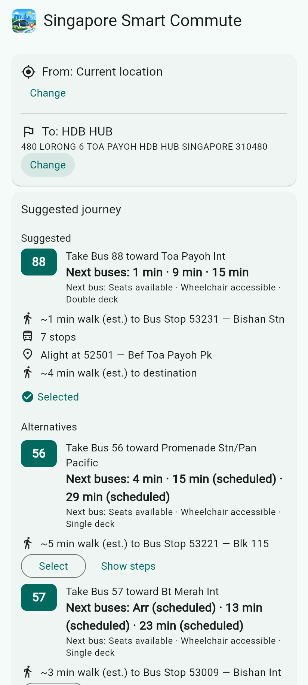
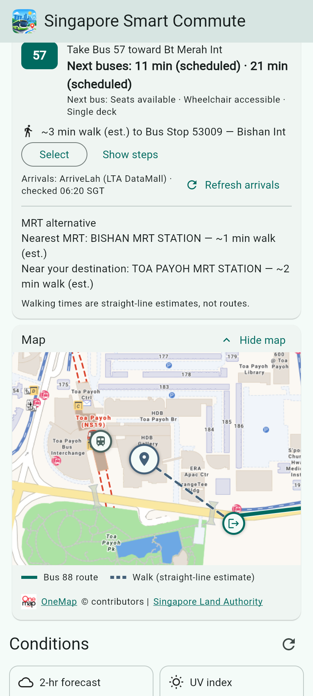
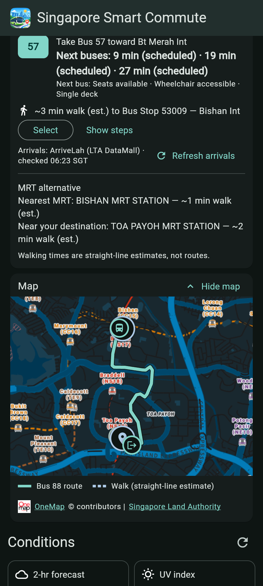

# Singapore Smart Commute

A **front-end-only** Flutter app (Android + Web) for Singapore. It shows current conditions (2-hour forecast,
UV, 1-hr PM2.5, 24-hr PSI) and suggests how to start a journey: a direct bus with live arrival times, and the
nearest MRT station as an alternative. University course project.

> **Status:** Phase 1 (M1–M5) and Phase 2 (the optional journey map, P2-M0–P2-M4) are complete: location with
> manual fallback, the environmental dashboard, OneMap place search, a direct-bus suggestion with live arrivals
> and an MRT alternative, and an optional map (OneMap basemap) showing the selected option's bus route, straight
> walking estimates and the MRT suggestions. UI polish is complete (PR #35, plus follow-ups after Phase 2).

Colour themes (post-submission enhancement E1): choose Teal, Blue, Rose, Purple or Orange from the palette button
in the app bar. The app still follows your system's light or dark mode and remembers the choice on this device or
browser.

App icon and About (post-submission enhancements E3, E4): the phone launcher, the Web favicon and the installable Web
app use the same bus, skyline and pin artwork as the app bar, under the name "Singapore Smart Commute". The info
button in the app bar shows what the app is, its author and the version and build it was built from.

Estimated trip time (post-submission enhancement E2): each direct-bus option shows "About N min · excl. waiting", a
rough static estimate of walking plus riding, rounded up to 5 minutes, and the estimated ride on its bus step. It
is not a live ETA.

## Screenshots

The release Web build at phone width with live data: a trip from Bishan to HDB Hub, Toa Payoh (2026-10-05,
06:20–06:24 SGT). The middle map is zoomed in by hand at the destination end, where the walking estimate and the MRT
marker show.

| Journey with live arrivals | Map at the destination end | Map, dark theme |
|---|---|---|
|  |  |  |

## No credentials required

The app calls only public, keyless, CORS-enabled data sources. It ships **no API keys or secrets**, and you
don't need to configure any `.env`, `--dart-define` or account. There is no backend or proxy. See
[`docs/architecture.md`](docs/architecture.md) (ADR-001).

## Prerequisites

| Tool | Version used |
|---|---|
| Flutter (stable) | 3.47.2 (Dart 3.13.2) |
| Chrome | for Web |
| Android SDK + emulator or device | SDK 36, JDK 21 (Android Studio) |

Run `flutter doctor` first. Visual Studio (Windows desktop) is **not** needed. Android builds need the SDK
licences accepted (`flutter doctor --android-licenses`). Gradle downloads the NDK, CMake and Platform 36 on
the first build, which can take 15–20 minutes.

## Setup

```bash
git clone https://github.com/WeeJC8954/sg-smart-commute.git
cd sg-smart-commute
flutter pub get
```

## Run

```bash
flutter run -d chrome        # Web
flutter devices              # find your Android emulator/device id
flutter run -d <device-id>   # Android
```

If `flutter run -d chrome` hangs at "Waiting for connection from debug service", serve the app instead and
open it yourself: `flutter run -d web-server --web-port 8766`, then browse to `http://localhost:8766`.

- **Web geolocation needs HTTPS** in deployed builds (`localhost` is exempt during development). Any
  hosted demo must be served over HTTPS (static hosting only).
- **Android emulator:** the default emulator location is outside Singapore. Set a Singapore location in
  Extended controls → Location.
- **Hosting the Web build:** `web/index.html` carries a Content-Security-Policy `<meta>` that allows only the
  app's own files, the four data APIs and the Flutter engine CDN (`www.gstatic.com`, `fonts.gstatic.com`). A
  new data source must be added to its `connect-src` (a test enforces this). A host that can send headers
  should also send `frame-ancestors`. Details: [`docs/architecture.md`](docs/architecture.md) (Milestone 5).

## Test and quality gates

```bash
dart format --set-exit-if-changed .
flutter analyze
flutter test
flutter build web
flutter build apk --debug

# Integration tests: real app, fake providers, no live APIs
flutter test integration_test -d <android-device-id>
# Web: needs chromedriver matching your Chrome on port 4444; one file per run
flutter drive --driver=test_driver/integration_test.dart   --target=integration_test/app_boot_test.dart -d web-server --browser-name=chrome --profile
```

The Web run uses a profile build on `web-server`, because debug-mode `flutter drive` does not start. The full
recipe, the dev-only feasibility probes and the run log are in [`docs/testing.md`](docs/testing.md).

A distributable release APK or bundle needs a release key: see
[`docs/release-signing.md`](docs/release-signing.md). Without one, `flutter build apk --release` falls back to
the debug key with a warning, for local smoke tests only.

## Data sources and attribution

NEA / data.gov.sg (Singapore Open Data Licence) · busrouter.sg (community project; bus data © LTA) ·
MRT station exits: LTA via data.gov.sg (Singapore Open Data Licence), bundled as `assets/mrt_stations.json`
(regenerate with `dart run tool/build_mrt_asset.dart`) · OneMap © SLA · live arrivals: ArriveLah (LTA DataMall).

ArriveLah is a third-party community service that proxies LTA DataMall bus-arrival data. It is not an official
LTA API. Its repository currently has no explicit licence file, and this project does not assume one; its
availability and usage rights are not guaranteed.
Details and limits: [`docs/data-sources.md`](docs/data-sources.md).

## Known limitations

- Walking times are **estimates** (straight-line × 1.3 at 80 m/min), not routed.
- The map's walking lines are straight-line estimates between the same points as the walking times; there is no
  walking router (`docs/map-feasibility.md` §6.1).
- The map needs network for its OneMap tiles (no offline maps); OneMap gives no service-level agreement.
- Phase 1 suggests **direct buses only** (no transfers), ranked by a documented heuristic, not "the best"
  route. MRT is shown as information only: the nearest station name and an estimated walk, with no lines,
  codes, routes or arrivals.
- Trip times (E2) are rough estimates based on scheduled early/late bus timings, rounded up to 5 minutes. They
  exclude waiting and live traffic conditions, and are not calibrated for daytime or rush-hour traffic.
- Bus stop data comes from busrouter.sg and is loaded on the first journey request (about 570 KB).
- Tokenless OneMap search can rate-limit (HTTP 429 after a few quick calls was seen in M3 testing).
- busrouter, ArriveLah and tokenless OneMap search are third-party services with no SLA.
- The Web build loads the Flutter engine (CanvasKit) and fallback fonts from Google's CDN (`www.gstatic.com`,
  `fonts.gstatic.com`), Flutter's default.
- On Android, if Google's "Location Accuracy" is off, Play services asks to turn it on. The app's 10 s
  location timeout keeps running behind that dialog, so you may briefly see "Finding your location took too
  long". Answering "Turn on" then fills in your location by itself; "No thanks" leaves manual entry. Accepted
  as a platform limitation (see [`docs/testing.md`](docs/testing.md)).
- On Web, the browser's location request returns only once it has a position, so after a late "Allow" the
  app keeps offering manual entry until a fix arrives.
- Live arrivals are shown only for the suggested buses' boarding stops and refresh only when you tap
  "Refresh arrivals" (reused for 15 s). An arrival can be missing (e.g. a peak-hour-only service off-peak):
  the app then says "No live arrival available" and still shows the route. "(scheduled)" marks estimates LTA
  bases on the timetable rather than the bus's position.
- Card motion: when several parts of the journey card update on consecutive frames, the card can land at its
  final size at once instead of playing the full resize animation; when a card shrinks, the removed content goes
  at once and only the freed space closes smoothly.
- At 2× text size, scrolling far down and back can collapse an alternative's expanded steps and return a manually
  panned map to its fitted view. The selected option, the open map and the journey data are kept.
- Accessibility is covered by semantics tests and the Web semantics tree; it has not been checked with a real
  screen reader (TalkBack attempts on the emulator were blocked) or on a physical device. Details:
  [`docs/testing.md`](docs/testing.md).
- The colour theme is stored per device or browser (a private window forgets it).

## Documentation

- [Implementation guide v2.1](docs/singapore-smart-commute-implementation-guide.v2.md)
- [API feasibility](docs/api-feasibility.md) · [Architecture](docs/architecture.md) ·
  [Data sources](docs/data-sources.md) · [Assumptions](docs/assumptions.md) · [Testing](docs/testing.md)
- [Colour themes plan (E1)](docs/e1-colour-themes-implementation-plan.md)
- [App icon and About plan (E3, E4)](docs/enhancement-phase-a-identity-about-implementation-plan.md)
- [Estimated trip time plan (E2)](docs/e2-static-journey-time-implementation-plan.md)

## Roadmap

M1 location + environment → M2 places → M3 direct-bus planner + MRT → M4 live arrivals → M5 hardening →
Phase 2 map (P2-M0 feasibility → P2-M1 map shell → P2-M2 bus ride line → P2-M3 option sync, walk connectors, MRT
markers → P2-M4 hardening): **complete**. UI polish: **complete** (PR #35, plus follow-ups after Phase 2).
